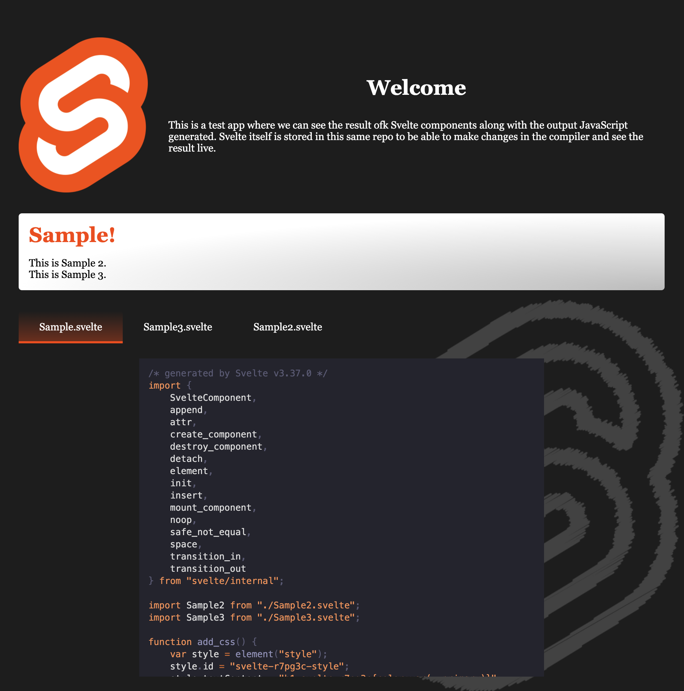

# Svelte App Compiler

This is a small application where I can tweak svelte compiler and see the result locally in real time.

The idea is that this repo implements an Svelte application whose compiler is not coming from a dev dependency but from a local copy of [Svelte's codebase](https://github.com/sveltejs/svelte) configured as a [yarn symlink](https://classic.yarnpkg.com/en/docs/cli/link/). Like this I can make modification in Svelte code base and see the result immediately.

Here is a small sample of how the application looks like:

 

  

